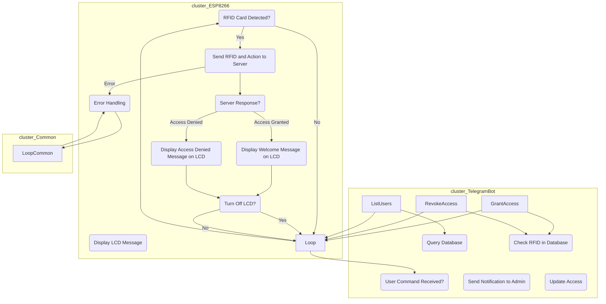

# Smart Access Control System: ESP8266 and Telegram Collaboration Readme

## Table of Contents

1. [Overview](#1-overview)
   - 1.1 [ESP8266 Code](#11-esp8266-code)
      - 1.1.1 [Requirements](#111-requirements)
      - 1.1.2 [Setup](#112-setup)
      - 1.1.3 [Functionality](#113-functionality)
   - 1.2 [Telegram-based Access Control System](#12-telegram-based-access-control-system)
      - 1.2.1 [Requirements](#121-requirements)
      - 1.2.2 [Setup](#122-setup)
      - 1.2.3 [Functionality](#123-functionality)
2. [Usage](#2-usage)
3. [Troubleshooting](#3-troubleshooting)
4. [System Flowchart](#4-system-flowchart)

## 1. Overview

The Smart Access Control System project comprises two main components: the ESP8266 code for RFID card detection and server communication, and the Python code for a Telegram-based access control system.

### 1.1 [ESP8266 Code](code/hardware/)

#### 1.1.1 Requirements

- ESP8266 board
- MFRC522 RFID reader
- 16x2 I2C Liquid Crystal Display
- WiFi connection

#### 1.1.2 Setup

1. Replace placeholders in the ESP8266 code (`your_wifi_ssid`, `your_wifi_password`, `your_cloud_server_address`) with your WiFi credentials and server details.
2. Adjust `buttonPin`, `lcd`, and `rfidReader` pin configurations based on your hardware setup.

#### 1.1.3 Functionality

- Detects RFID cards using the MFRC522 reader.
- Sends RFID card data and action (enter/exit) to a server via HTTP POST.
- Displays user messages on the LCD screen based on server responses.
- Supports turning off the LCD backlight after a specified delay.

### 1.2 [Telegram-based Access Control System](code/server/)

#### 1.2.1 Requirements

- Python environment
- Flask web framework
- SQLite database
- Telegram bot token and chat ID

#### 1.2.2 Setup

1. Install required Python packages: `flask`, `python-telegram-bot`.
2. Replace `your_database.db` with the desired SQLite database filename.
3. Set `your_telegram_token` and `your_chat_id` with your Telegram bot credentials.
4. Run the Python script on a server accessible from the ESP8266.

#### 1.2.3 Functionality

- Manages user data in an SQLite database (name and RFID card).
- Uses a Telegram bot to grant or revoke access.
- Sends notifications to the admin when access is granted or revoked.
- Provides a list of users with access.

## 2. Usage

1. Upload the ESP8266 code to your device.
2. Run the Python script on your server.
3. Use Telegram commands (`/grant_access`, `/revoke_access`, `/list_users`) to manage access.

## 3. Troubleshooting

- Check the serial monitor for ESP8266 debugging information.
- Ensure the server is running and accessible.
- Verify Telegram bot credentials and chat ID.

## 4. System Flowchart

