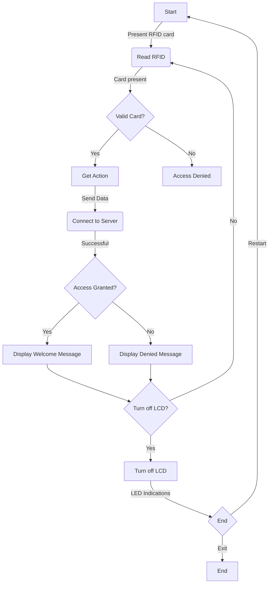

# RFID Access Control System

## Overview

This project implements an RFID access control system using an ESP8266 microcontroller, RFID reader (MFRC522), and LEDs. The system connects to a cloud server to process RFID card data and provides feedback through an LCD display and LEDs.

## Features

- Read RFID card information.
- Connect to a Wi-Fi network for data communication.
- Send RFID card data and action (enter/exit) to a cloud server.
- Display messages on an LCD screen based on server responses.
- Illuminate LEDs (green for access granted, red for access denied).

## Hardware Requirements

- ESP8266 microcontroller (NodeMCU or similar)
- MFRC522 RFID reader
- LCD with I2C interface (e.g., LiquidCrystal_I2C)
- LEDs (green and red)
- Resistors, wires, and breadboard
- Power source (USB or external power supply)

## Wiring

- Connect the RFID reader and LCD to the specified pins on the ESP8266.
- Connect green and red LEDs to the specified pins for access granted and access denied indications.

## Setup

1. Install necessary libraries:
   - Wire
   - LiquidCrystal_I2C
   - ESP8266WiFi
   - ESP8266HTTPClient
   - MFRC522

2. Replace placeholder values in the code:
   - Set your Wi-Fi credentials (`ssid` and `password`).
   - Set the cloud server address (`server`).
   - Adjust pin numbers according to your wiring.

3. Upload the code to the ESP8266 using the Arduino IDE or another suitable platform.

## Usage

1. Power on the system.
2. Present an RFID card to the reader.
3. LEDs indicate access status, and LCD displays corresponding messages.
4. System communicates with the cloud server for access verification.

## Additional Notes

- Ensure that the cloud server is configured to receive and process RFID card data.
- Customize LCD messages and LED indications based on your requirements.

## Flowchart

